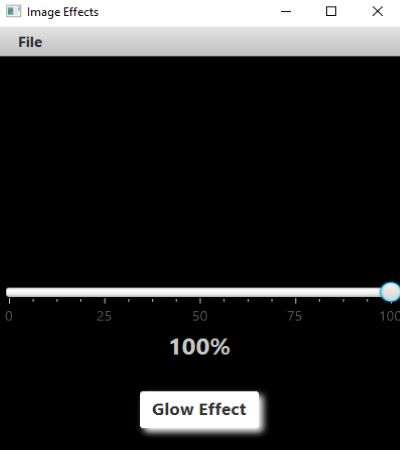
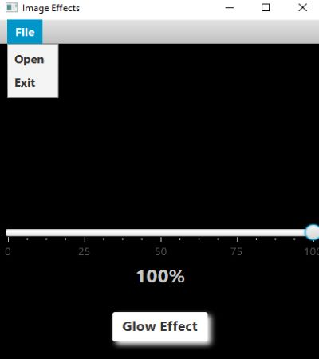
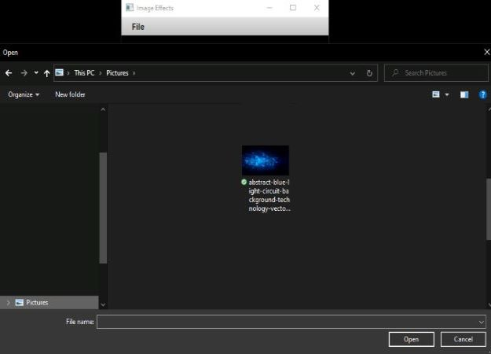
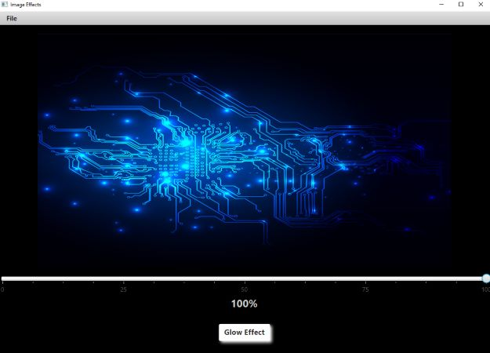
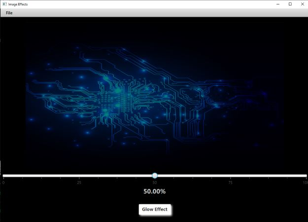
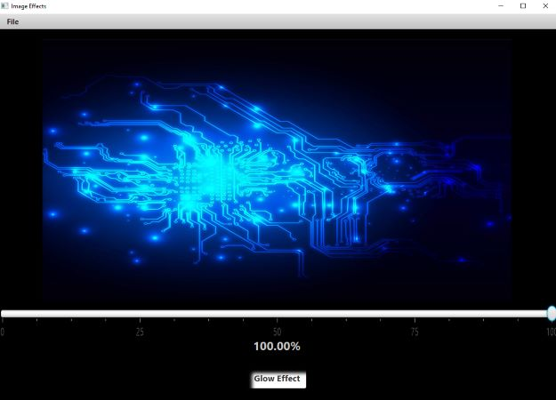
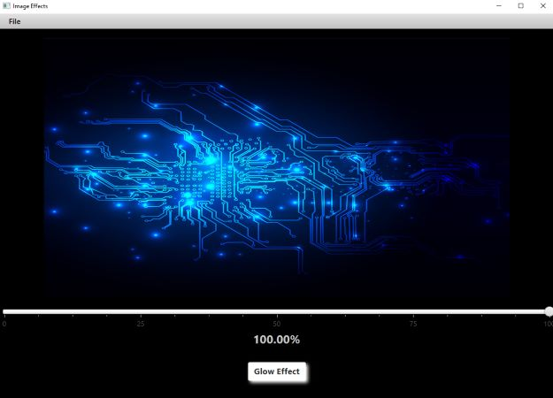
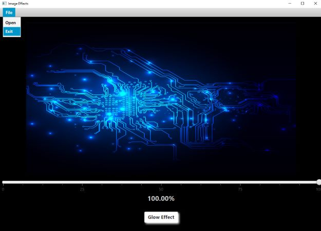

<h1 align="center">Welcome to Image Adjust</h1>

<!--  -->

<h4 align="center">
  Javafx: the file drop down menu will allow you to select open or exit.  Selecting open will open the file explorer to locate an image.  The slider adjusts the opacity of the image.  Clicking on glow effect will enable/disable the glow effect.
</h4>
 

<h2 align="center" style="text-decoration: underline;">Using this GUI is as follows:</h2>

<h4 align="center">
    1. Click on the file drop down menu.

  <!--  -->
</h4>

<h4 align="center">
    2. Click on Open to open file explorer and select and image to adjust.  The window size will automatically adjust to the image size.

  <!--  -->
</h4>

<h4 align="center">
    3. Now you are able to move the slider to adjust the opacity.  The percentage amount will be displayed below the slider.  

  <!--  -->
</h4>

<h4 align="center">
    4. Clicking on the Glow Effect button will turn on the glow effect.  

  <!--  -->
</h4>

<h4 align="center">
    5. Clicking on the Glow Effect button again will turn off the glow effect.  

  <!--  -->
</h4>

<h4 align="center">
    6. To exit the program, click on File drop down menu.  Then click on Exit.  

  <!--  -->
</h4>

<!-- For more details see [GitHub Flavored Markdown](https://guides.github.com/features/mastering-markdown/). -->
<!-- You can use the [editor on GitHub](https://github.com/zuki07/Load_file/edit/master/README.md) to maintain and preview the content for your website in Markdown files. -->
